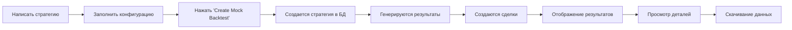
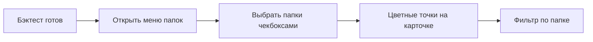

# 📊 SMIIO Backtest Platform - Документация проекта

## 🎯 Описание

**SMIIO Backtest Platform** - веб-приложение для бэктестинга торговых стратегий на исторических данных. Платформа позволяет пользователям создавать стратегии в формате JSON, запускать бэктесты, анализировать результаты и организовывать их в папки.

---

## 🏗️ Архитектура

### Stack технологий

- **Frontend**: Next.js 15.5.4 (React 19)
- **Styling**: Tailwind CSS 4
- **Database**: Supabase (PostgreSQL)
- **Language**: TypeScript 5
- **Build**: Turbopack
- **Libraries**:
  - `@supabase/supabase-js` - интеграция с БД
  - `jszip` - создание ZIP архивов

### Структура проекта

```
smiio-backtest-platform/
├── app/
│   ├── page.tsx                    # Главная страница (Dashboard)
│   ├── backtest/
│   │   └── page.tsx               # Страница создания бэктеста
│   ├── components/
│   │   └── BacktestDetailsModal.tsx  # Модалка с деталями
│   └── layout.tsx                 # Root layout
├── lib/
│   └── supabase.ts                # Supabase клиент
├── supabase/
│   └── schema.sql                 # SQL схема БД
└── public/                        # Статические файлы
```

---

## 📋 Функциональность

### 1. Dashboard (Главная страница)

#### Основные возможности:
- 📊 **Список бэктестов** - таблица со всеми выполненными тестами
- 🔍 **Поиск** - по имени стратегии
- 🗂️ **Папки** - организация бэктестов с множественным выбором
- 🎨 **Цветовая маркировка** - уникальные цвета для папок
- 📈 **Сортировка** - по дате, winrate, Sharpe, PnL
- 🔽 **Фильтрация** - все/прибыльные/убыточные
- 💾 **Экспорт** - скачивание результатов (CSV + JSON)
- 👁️ **Просмотр деталей** - модальное окно с таблицей сделок

#### Компоненты:
```typescript
// Интерфейсы данных
interface Backtest {
  id: string;
  created_at: string;
  strategy_id: string;
  job_id: string;
  status: string;
  n_trades: number;
  n_wins: number;
  n_losses: number;
  winrate: number;
  total_pnl: number;
  sharpe_ratio: number;
  max_drawdown: number;
  profit_factor: number;
  folder_ids?: string[];
  strategies: { name: string };
}

interface Folder {
  id: string;
  name: string;
  color: string;
  created_at: string;
}
```

#### Анимации:
- **Typewriter эффект** - заголовок печатается символ за символом
- **Мигающий курсор** - имитация терминала
- **Fade-in** - плавное появление элементов

---

### 2. Backtest Page (Создание бэктеста)

#### Основные возможности:
- ✍️ **JSON редактор** - для написания стратегии
- 🎛️ **Конфигурация** - имя, даты начала/конца
- 🚀 **Запуск** - симуляция или создание мок-данных
- 📊 **Результаты** - отображение после завершения
- 💾 **Скачивание** - экспорт результатов
- 🖥️ **Терминал** - вывод логов процесса

#### Этапы работы:

1. **Конфигурация** (до запуска)
   - Форма с полями: Strategy Name, Start Date, End Date
   - JSON редактор стратегии
   - Информационная панель с инструкциями

2. **Выполнение** (во время)
   - Прогресс бар
   - Фазы: Initializing → Loading Data → Running Strategy → Computing Metrics → Finalizing
   - Терминал с логами
   - Таймер

3. **Результаты** (после завершения)
   - Метрики: Total PnL, Winrate, Total Trades, Sharpe Ratio
   - Риск-метрики: Max Drawdown, Profit Factor
   - Кнопки: View Details, Download, Go to Dashboard

#### JSON формат стратегии:
```json
{
  "name": "MA Crossover Strategy",
  "description": "Simple moving average crossover",
  "indicators": [
    {
      "type": "SMA",
      "period": 20,
      "source": "close"
    }
  ],
  "entry": {
    "long": "ma_fast > ma_slow",
    "short": "ma_fast < ma_slow"
  },
  "exit": {
    "stop_loss": 0.02,
    "take_profit": 0.04
  },
  "parameters": {
    "fastPeriod": 10,
    "slowPeriod": 20,
    "timeframe": "1h"
  }
}
```

---

### 3. Details Modal (Детали бэктеста)

#### Вкладки:

**1. Results (Результаты)**
- 📋 Таблица всех сделок
- 🎨 Цветовые зоны (LONG/SHORT)
- 📊 Колонки: Date, Time, Entry/Exit Price, Change %, Signal, Side, PnL, Duration
- 🔢 F1-F4 флаги и TF1-TF4 направления
- 📈 Аналитика: Total PnL, Winrate, Avg Win/Loss, Profit Factor, Best/Worst Trade, Avg Duration, Long/Short соотношение

**2. Strategy Code (Код стратегии)**
- 💻 JSON отображение стратегии
- 🎨 Подсветка синтаксиса
- 📋 Полная конфигурация

#### Функции:
- 💾 **Download** - выбор что скачать (Results CSV / Strategy JSON)
- 📦 **ZIP архив** - автоматическая упаковка
- 🔒 **Stable data** - hash-функция для консистентности F-флагов

---

## 🗄️ База данных

### Таблицы

#### 1. `strategies`
```sql
id              UUID PRIMARY KEY
created_at      TIMESTAMP
updated_at      TIMESTAMP
name            TEXT NOT NULL
description     TEXT
config          JSONB NOT NULL
user_id         UUID REFERENCES auth.users
is_public       BOOLEAN DEFAULT false
```

#### 2. `backtests`
```sql
id                    UUID PRIMARY KEY
created_at            TIMESTAMP
strategy_id           UUID REFERENCES strategies
job_id                TEXT
status                TEXT DEFAULT 'pending'

-- Основные метрики
n_trades              INTEGER
n_wins                INTEGER
n_losses              INTEGER
winrate               DECIMAL
total_pnl             DECIMAL
avg_pnl               DECIMAL
med_pnl               DECIMAL
profit_factor         DECIMAL
sharpe_ratio          DECIMAL
max_drawdown          DECIMAL

-- Временные метрики
avg_duration          DECIMAL
pnl_per_day           DECIMAL
pnl_per_month         DECIMAL
pnl_per_year          DECIMAL
trades_per_day        DECIMAL

-- Дополнительно
strategy_code         JSONB
folder_ids            UUID[]
user_id               UUID REFERENCES auth.users
```

#### 3. `trades`
```sql
id                UUID PRIMARY KEY
created_at        TIMESTAMP
backtest_id       UUID REFERENCES backtests
trade_number      INTEGER
entry_time        TIMESTAMP
entry_price       DECIMAL
exit_time         TIMESTAMP
exit_price        DECIMAL
side              TEXT (long/short)
pnl               DECIMAL
duration_minutes  INTEGER
```

#### 4. `folders`
```sql
id           UUID PRIMARY KEY
created_at   TIMESTAMP
name         TEXT NOT NULL
color        TEXT NOT NULL
user_id      UUID REFERENCES auth.users
```

### Индексы
```sql
CREATE INDEX idx_backtests_user_id ON backtests(user_id);
CREATE INDEX idx_backtests_created_at ON backtests(created_at DESC);
CREATE INDEX idx_backtests_strategy_id ON backtests(strategy_id);
CREATE INDEX idx_backtests_folder_ids ON backtests USING GIN(folder_ids);
CREATE INDEX idx_trades_backtest_id ON trades(backtest_id);
```

### RLS Политики
- Включены для всех таблиц
- Пользователи видят только свои данные
- Публичные стратегии доступны всем

---

## 🔄 Workflow

### Создание и запуск бэктеста



### Организация в папки



---

## 🎨 UI/UX особенности

### Дизайн система

**Цвета:**
- Primary: Cyan (#06B6D4) → Blue (#3B82F6)
- Success: Green (#10B981) → Emerald (#059669)
- Warning: Orange (#F97316) → Red (#EF4444)
- Purple: Purple (#A855F7) → Pink (#EC4899)

**Градиенты:**
```css
bg-gradient-to-r from-cyan-500 to-blue-600
bg-gradient-to-br from-gray-950 via-gray-900 to-gray-950
bg-gradient-to-r from-cyan-400 to-blue-500 bg-clip-text text-transparent
```

**Анимации:**
```css
@keyframes fadeIn {
  from { opacity: 0; transform: translateY(-10px); }
  to { opacity: 1; transform: translateY(0); }
}

@keyframes shimmer {
  0% { transform: translateX(-100%); }
  100% { transform: translateX(100%); }
}

@keyframes slideIn {
  from { opacity: 0; transform: translateX(20px); }
  to { opacity: 1; transform: translateX(0); }
}
```

### Компоненты

**Кнопки:**
- Primary: `bg-gradient-to-r from-cyan-500 to-blue-600 hover:scale-[1.02]`
- Success: `bg-gradient-to-r from-green-500 to-emerald-600`
- Secondary: `bg-gradient-to-r from-purple-500 to-pink-600`

**Карточки:**
- Glass effect: `bg-gray-900/80 backdrop-blur-sm`
- Borders: `border border-gray-800/50`
- Shadows: `shadow-2xl shadow-cyan-500/20`

---

## 🔧 Настройка и запуск

### Установка

```bash
# Клонировать репозиторий
git clone <repo-url>

# Установить зависимости
npm install

# Настроить .env
NEXT_PUBLIC_SUPABASE_URL=your_supabase_url
NEXT_PUBLIC_SUPABASE_ANON_KEY=your_anon_key

# Запустить dev сервер
npm run dev
```

### Применить схему БД

```bash
# В Supabase Dashboard → SQL Editor
# Выполнить supabase/schema.sql
```

---

## 📦 Экспорт данных

### Формат ZIP архива

```
backtest_StrategyName_2025-10-05.zip
├── results.csv          # Таблица сделок
└── strategy.json        # Конфигурация стратегии
```

### Формат CSV

```csv
Date,Time,Entry Price,Exit Price,Change %,Signal,Side,PnL,Duration (min)
10/5/2025,14:30:00,48500.00,48750.50,0.52,SMIIO LONG,long,250.50,45
10/5/2025,16:15:00,48750.00,48600.25,-0.31,SMIIO SHORT,short,149.75,30
```

---

## 🚀 Развертывание

### Production build

```bash
npm run build
npm run start
```

### Vercel deployment

```bash
vercel --prod
```

### Environment Variables

```env
NEXT_PUBLIC_SUPABASE_URL=https://xxx.supabase.co
NEXT_PUBLIC_SUPABASE_ANON_KEY=eyJhbGc...
```

---

## 📝 Примечания

1. **Mock функции** используются для демо, легко заменяются на реальные API
2. **RLS политики** требуют настройки аутентификации Supabase
3. **Типы данных** TypeScript соответствуют схеме БД
4. **Анимации** оптимизированы для производительности
5. **Цвета папок** генерируются автоматически из палитры

---

## 🔗 Связанные документы

- `BACKEND_INTEGRATION.md` - Инструкции для бэкенд-разработчика
- `ANALYSIS.md` - Анализ качества кода
- `supabase/schema.sql` - Схема базы данных
